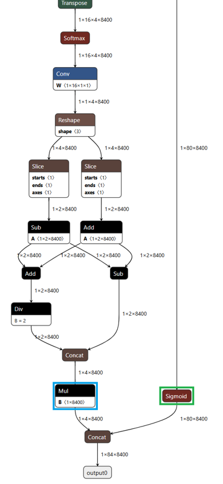

This chapter describes various parameters required for compiling an ONNX model using the **DX_COM**. It includes input specifications, calibration methods, data preprocessing settings, and optional parameters for advanced compilation schemes.  

These parameters are defined in a JSON file, which serves as a blueprint for how the compiler interprets and processes the input model.  

---

## Parameter Quick Reference

| Parameter | Required | Description |
|-----------|----------|-------------|
| `inputs` | Yes | Model input name and shape: `{"name": [1,C,H,W]}` |
| `calibration_method` | Yes | Calibration method: `"ema"` or `"minmax"` |
| `calibration_num` | Yes | Number of calibration samples (e.g., 100) |
| `default_loader` | Yes | Preprocessing configuration with dataset loading |
| `enhanced_scheme` | No | DXQ-P0~P5 quantization enhancement for accuracy improvement (DX-COM v2.1.0+) |
| `ppu` | No | Object detection post-processing (YOLO models) |

For complete examples, see [Common Use Cases](02_07_Common_Use_Cases.md).  

---

## Required Parameters  

### Inputs  

Defines the input name and shape of the ONNX model.  

!!! warning "Model Input Restrictions"
    - The batch size **must** be fixed to 1.  
    - **Only** a single input is supported with CLI. For multi-input models, use the Python API with DataLoader (see [Python Wheel Package Usage](02_06_Execution_of_DX-COM.md#python-wheel-package-usage)).  
    - Input name **must** exactly match ONNX model definition.

Example  
```json
{
  "inputs": {
    "input.1": [1, 3, 512, 512]
  }
}
```

In this example, `"input.1"` is the name of the input tensor and its shape is `[1, 3, 512, 512]`, where:

- `1`: batch size (**must be 1**)  
- `3`: number of channels (e.g., RGB)  
- `512 x 512`: image height and width

---

### Calibration Method  

Defines the calibration method used during quantization. It is essential for maintaining model accuracy after compilation by determining appropriate activation ranges.  

Available Methods  

- `ema`:  
  Uses exponential moving average of activation values.  
  Recommended for improved post-quantization accuracy.  

- `minmax`:  
  Uses the minimum and maximum activation values to determine quantization range.

Example
```json
{
  "calibration_method": "ema"
}
```

---

### Calibration Number

Defines the number of steps used during calibration. A higher number may improve quantization accuracy by better estimating activation ranges, but may also increase compile time.  

To minimize the accuracy degradation, it is recommended to try different values, such as 1, 5, 10, 100, or 1000, and determine the value that yields the best accuracy for your model.

Example
```json
{
  "calibration_num": 100
}
```

---

### Calibration Data Loading

You must provide calibration data using the `default_loader` parameter, which specifies the dataset location, accepted file types, and preprocessing steps:

```json
{
  "default_loader": {
    "dataset_path": "/datasets/ILSVRC2012",
    "file_extensions": ["jpeg", "png", "jpg", "JPEG"],
    "preprocessings": [
      {"resize": {"width": 224, "height": 224}},
      {"normalize": {"mean": [0.485, 0.456, 0.406], "std": [0.229, 0.224, 0.225]}}
    ]
  }
}
```

For all available preprocessing operations, see [Appendix: Preprocessing Operations Reference](#appendix-preprocessing-operations-reference).

**For Multi-Input Models or Non-Image Data**  

If you need to compile multi-input models or provide non-image data, use the Python wheel package with torch DataLoader instead of JSON configuration. See [Python Wheel Package Usage](02_06_Execution_of_DX-COM.md#python-wheel-package-usage).  

---

## Optional Parameters: Enhanced Quantization Scheme (DXQ)

!!! note "Version Support"
    DXQ (`enhanced_scheme`) is supported in **DX-COM v2.1.0 and later**.

When quantizing a model, accuracy degradation may occur compared to the original model. To mitigate this, **Q-PRO options** (DXQ-P0 to DXQ-P5) can be used to enhance quantization performance.  

| Name | Compilation Speed | Accuracy Improvement |
|------|------------------|----------------------|
| DXQ-P0 | Very Fast | Low |
| DXQ-P1 | Fast | Low-Middle |
| DXQ-P2 | Quite Slow | Middle-High |
| DXQ-P3 | Very Slow | High |
| DXQ-P4 | Very Slow | High |
| DXQ-P5 | Very Slow | High |

!!! note "Recommendation"
    **Best Accuracy**: DXQ-P3 and DXQ-P4 generally offer better accuracy, so try them first.  
    
    **GPU Acceleration**: DXQ schemes (especially P2-P5) are computationally intensive. Using `quantization_device="cuda"` can reduce compilation time by **2-5x** compared to CPU. 
    See [Use Case 5: GPU-Accelerated Quantization](02_07_Common_Use_Cases.md#use-case-5-gpu-accelerated-quantization) for examples.  

!!! warning "Limitations"
    Results are **not guaranteed** to improve accuracy. Results may vary depending on the model and dataset.


**DXQ-P0**  
Uses an alpha value to control the strength of the quantization enhancement.

```json
{
  "enhanced_scheme": {
    "DXQ-P0": {
      "alpha": 0.5
    }
  }
}
```

**DXQ-P1**  
Enables a simple quantization improvement strategy.

```json
{
  "enhanced_scheme": {
    "DXQ-P1": true
  }
}
```

**DXQ-P2**  
Uses a more refined strategy with `alpha`, `beta`, and `cosim_num` parameters.

```json
{
  "enhanced_scheme": {
    "DXQ-P2": {
      "alpha": 0.1,
      "beta": 1.0,
      "cosim_num": 2
    }
  }
}
```

**DXQ-P3, DXQ-P4, DXQ-P5**  
Support the optional `num_samples` parameter. Recommended value: 1024.

```json
{
  "enhanced_scheme": {
    "DXQ-P3": {
      "num_samples": 1024
    }
  }
}
```

---

## Optional Parameters: PPU Configuration

The Post-Processing Unit (PPU) is a hardware-accelerated engine within the NPU designed to offload compute-intensive detection tasks from the host CPU. By executing these tasks directly on silicon, the PPU ensures lower latency and reduced CPU utilization—critical for resource-constrained edge environments.  

The PPU automates the following operations at the hardware level:  

- **Confidence Filtering:** Hardware-level removal of detection candidates below a specified threshold.  
- **Class Prediction:** Execution of Argmax operations to identify the highest probability class per detection.  

!!! warning "IMPORTANT"  
    **NMS** (Non-Maximum Suppression) is not supported by the PPU hardware. NMS operations must be executed on the host CPU using the filtered output from the PPU.  

---

### Operational Guidelines  

Before enabling the PPU, verify that your model architecture and system requirements align with the following criteria:  

Recommended Use Cases (Enable)  

- **Model Compatibility:** Optimized for the YOLO family and similar object detection architectures.  
- **Hardware Constraints:** Highly recommended for edge devices with limited CPU overhead.  
- **Performance Goals:** Necessary for real-time applications requiring high FPS (Frames Per Second).  

Non-Supported Scenarios (Disable)  

- **Classification Models:** (e.g., ResNet, MobileNet) These models do not require the filtering logic provided by the PPU.  
- **Segmentation Models:** (e.g., DeepLab, U-Net) These rely on pixel-level mask processing, which is incompatible with PPU logic.  
- **Custom Architectures:** Any model utilizing a detection head that does not align with standard YOLO-style output tensors.  

---

### Performance Impact  

Shifting detection head processing from software (CPU) to hardware (NPU) provides a significant uplift in end-to-end inference speed.  

| Feature | CPU-based (PPU Disabled) | Hardware-based (PPU Enabled) |
|------|------|------|
| Processing Site | Host CPU | NPU Hardware |
| Inference Latency | Higher (Variable) | Lower (Deterministic) |
| CPU Utilization | Significant | Minimal |

---

### Configuration Parameters  

| Type | Architecture | Supported Models |
|------|--------------|------------------|
| 0 | Anchor-Based | YOLOv3, YOLOv4, YOLOv5, YOLOv7 |
| 1 | Anchor-Free | YOLOX, YOLOv8, YOLOv9, YOLOv10, YOLOv11, YOLOv12 |

---

### Type 0: Anchor-Based YOLO Models

```json
{
  "ppu": {
    "type": 0,
    "conf_thres": 0.25,
    "activation": "Sigmoid",
    "num_classes": 80,
    "layer": {
      "Conv_245": {"num_anchors": 3},
      "Conv_294": {"num_anchors": 3},
      "Conv_343": {"num_anchors": 3}
    }
  }
}
```

Parameters:

- `type`: Set to `0` for anchor-based models
- `conf_thres`: Confidence threshold (fixed at compile time)
- `num_classes`: Number of detection classes
- `activation`: Typically `"Sigmoid"`
- `layer`: Dictionary mapping Conv node names to anchor configurations

---

### Type 1: Anchor-Free YOLO Models

**YOLOX Example:**
```json
{
  "ppu": {
    "type": 1,
    "conf_thres": 0.25,
    "num_classes": 80,
    "layer": [
      {"bbox": "output_bbox_1", "obj_conf": "output_obj_1", "cls_conf": "output_cls_1"},
      {"bbox": "output_bbox_2", "obj_conf": "output_obj_2", "cls_conf": "output_cls_2"},
      {"bbox": "output_bbox_3", "obj_conf": "output_obj_3", "cls_conf": "output_cls_3"}
    ]
  }
}
```

**YOLOv8/v9/v10/v11/v12 Example:**
```json
{
  "ppu": {
    "type": 1,
    "conf_thres": 0.25,
    "num_classes": 80,
    "layer": [
      {"bbox": "Mul_441", "cls_conf": "Sigmoid_442"}
    ]
  }
}
```

Parameters:

- `type`: Set to `1` for anchor-free models
- `conf_thres`: Confidence threshold (fixed at compile time)
- `num_classes`: Number of detection classes
- `layer`: List of layer configurations
    - `bbox`: Bounding box output layer
    - `obj_conf`: Object confidence layer (YOLOX only)
    - `cls_conf`: Class confidence layer

---

### Implementation: Identifying ONNX Node Names

To configure PPU, you need to identify specific node names in your ONNX model:

**Step 1.** Open your model in [Netron](https://netron.app) to visualize the ONNX graph

**Step 2.** For Type 0 (Anchor-based YOLO):

- Trace backwards from model outputs to locate detection head Conv layers
- These Conv layers output feature maps with shape `[1, num_anchors*(5+num_classes), H, W]`
- Example node names in YOLOv7: `/model.105/m.0/Conv`, `/model.105/m.1/Conv`, `/model.105/m.2/Conv`

{ width=600px }

**Step 3.** For Type 1 (YOLOX):

- Find three types of Conv nodes for each detection scale: `bbox`, `obj_conf`, `cls_conf`
- This results in 9 Conv layers total (3 scales × 3 branches)

{ width=600px }

**Step 4.** For Type 1 (YOLOv8 and later):

- Trace backwards from the final `Concat` operation
- Identify `bbox` (often from `Mul` or `Add`) and `cls_conf` (often from `Sigmoid`)
- Only **one layer** entry is needed

{ width=350px }

---

## Appendix: Preprocessing Operations Reference

The following preprocessing operations can be applied to input data when using `default_loader`. These operations help standardize input formats and ensure consistency between calibration and deployment.

!!! warning "Automatic Preprocessing Optimization"
    To maximize performance, the compiler may automatically integrate specific preprocessing operations directly into the NPU execution graph. This hardware-level integration reduces host CPU load and minimizes data transfer latency.  

    Optimization depends on input data types and model architecture; therefore, integration **is not guaranteed** for all operations.  
    
    **How to Verify and Optimize:**  
    After compilation, inspect the compilation logs for `[INFO] - Added nodes: messages.` This indicates which operations have been offloaded to the NPU.  

    **1. Identify Integrated Nodes:**  Check your log for entries similar to the following: `[INFO] - Added nodes: ['Normalize', 'Cast', 'Transpose']`  
    ```
    [INFO] - Added nodes: Div(x=255) -> Normalize(mean=[0.485, 0.456, 0.406], std=[0.229, 0.224, 0.225])
    ```
    
    **2. Update Runtime Code:** If an operation is listed in the "Added nodes" log, it is now handled by the NPU hardware. You must remove these operations from your host-side runtime code to prevent redundant processing and performance degradation.  
  
    | Status in Log | Action Required | Result|
    |------|------|------|
    | Node Added | Remove from Host Code | Hardware Acceleration Enabled |
    | Node Not Added | Keep in Host Code | Software Preprocessing (CPU) |
      
    ```python
    # If preprocessing is NOT integrated into NPU:
    img = img / 255.0
    normalized = (img - mean) / std
    output = model.run(normalized)
    
    # If preprocessing IS integrated into NPU (log shows "Added nodes"):
    output = model.run(img)  # Skip preprocessing - NPU handles it automatically
    ```

**convertColor**  

Changes the color channel order of input images.  

```json
{"convertColor": {"form": "BGR2RGB"}}
```

Supported values: `RGB2BGR`, `BGR2RGB`, `RGB2GRAY`, `BGR2GRAY`, `RGB2YCrCb`, `BGR2YCrCb`, `RGB2YUV`, `BGR2YUV`, `RGB2HSV`, `BGR2HSV`, `RGB2LAB`, `BGR2LAB`

**resize**  

Resizes input image to a specified target size.  

```json
{"resize": {"mode": "default", "width": 320, "height": 320, "interpolation": "LINEAR"}}
```

| Mode | Supported Interpolation Methods |
|------|--------------------------------|
| `default` (OpenCV) | `LINEAR`, `NEAREST`, `CUBIC`, `AREA`, `LANCZOS4` |
| `torchvision` (PIL) | `BILINEAR`, `NEAREST`, `BICUBIC`, `LANCZOS` |

**centercrop**  

Crops the central region of the input image.  

```json
{"centercrop": {"width": 224, "height": 224}}
```

**transpose**  

Rearranges tensor dimensions.  

```json
{"transpose": {"axis": [0, 2, 3, 1]}}
```

**expandDim**  

Adds a new dimension at the specified axis.  

```json
{"expandDim": {"axis": 0}}
```

**normalize**  

Normalizes input data by mean and standard deviation. This operation may be integrated into the NPU graph during compilation (see [NPU Integration](#appendix-preprocessing-operations-reference) above).  

```json
{"normalize": {"mean": [0.485, 0.456, 0.406], "std": [0.229, 0.224, 0.225]}}
```

**mul, add, subtract, div**  

Arithmetic operations on input data. The `subtract` and `div` operations may be integrated into the NPU graph during compilation (see [NPU Integration](#appendix-preprocessing-operations-reference) above).  

```json
{"mul": {"x": 255}}
{"add": {"x": 128}}
{"subtract": {"x": 127}}
{"div": {"x": 255}}
```

---

## Appendix: Custom Loader (Legacy)

!!! warning "Deprecation Notice"
    The Custom Loader approach is **deprecated**. For new projects, use the [Python wheel package with torch DataLoader](02_06_Execution_of_DX-COM.md#python-wheel-package-usage) instead, which provides more flexibility and better integration with Python workflows.

For legacy projects that still require Custom Loader, download the [Custom Dataloader Guide](http://cs.deepx.ai/_deepx_fae_archive/docs/Custom_Dataloader_Guide_241204.zip) for detailed instructions.  

---
